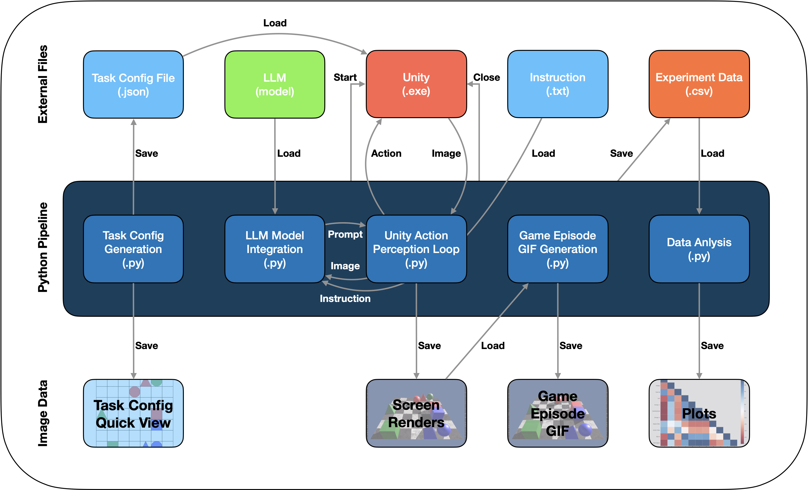
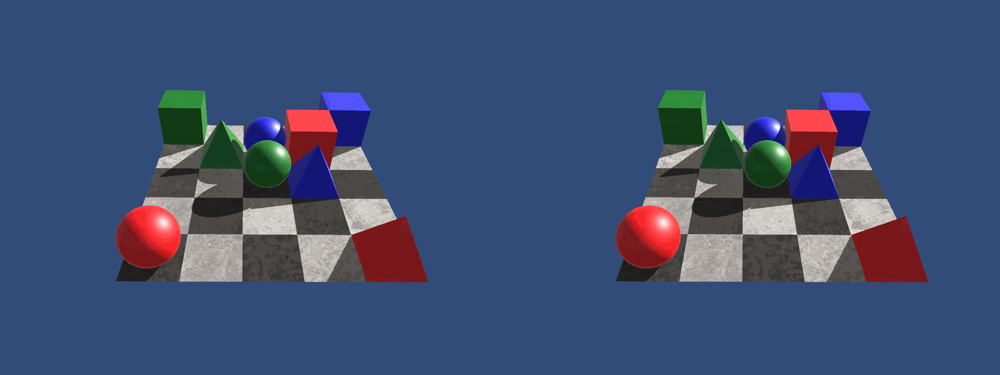
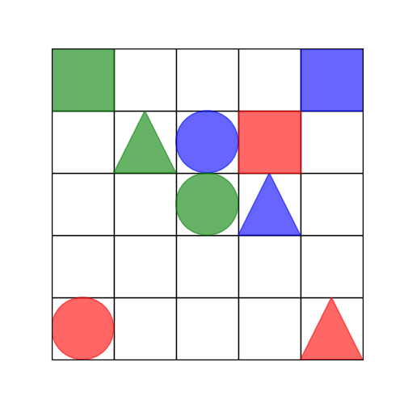

# RIPPLE

This codebase consists of the following components:

- Python files
- Unity assets
- External files

Your setup may work directly with the provided executable (`.exe` file). If not, you'll need to install Unity and build the project on your machine using the provided assets. The Python scripts can interact with the project in the Unity Editor, but this makes automated testing of LLMs more challenging, as the application needs to start and close for each task. There should be no need to modify the Unity assets or application code. Once the Unity application is built, everything else runs via Python.

The diagram below illustrates the experimental pipeline and the key files involved. Python scripts can be run individually for more control or all at once using the main Python script.

## Task Generation

1. Generate a random task using the `TaskGeneration.py` script.
2. This script will generate a JSON configuration file with a UUID.
3. The Unity application uses this JSON configuration file.
4. It also generates a quick visual preview of the task configuration.

## LLM Integration

- Currently, this script only accepts user input.
- LLM experts are needed to further develop the integration.

## Unity Startup

1. The Unity application needs to be started at this point to set up a TCP server.
2. Before starting, move the previously generated configuration file to the `resources` folder and rename it to `puzzle.json`.
3. Start the Unity application either manually or via the provided Python script.
4. After completing one episode of the Action-Perception Loop, Python will automatically close the application.

## Action-Perception Loop

- This script handles the interaction between Python and Unity.
- LLM prompts are sent to Unity as actions, and Unity's screen captures are returned, saved, and passed to the LLM for feedback.
- A TCP connection is used to facilitate communication with Unity.
- You can limit the number of actions allowed before an episode is considered a failure (recommended).
- After an interaction, the script returns the episode data (e.g., success status and number of actions taken).

## Episode GIFs

- After one or more episodes, you can use the screen captures to generate a GIF of the episode. This allows the interactions to be preserved and reviewed later.

