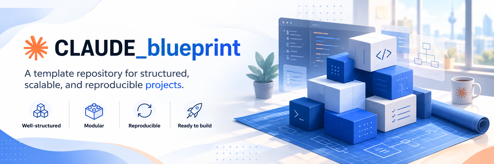
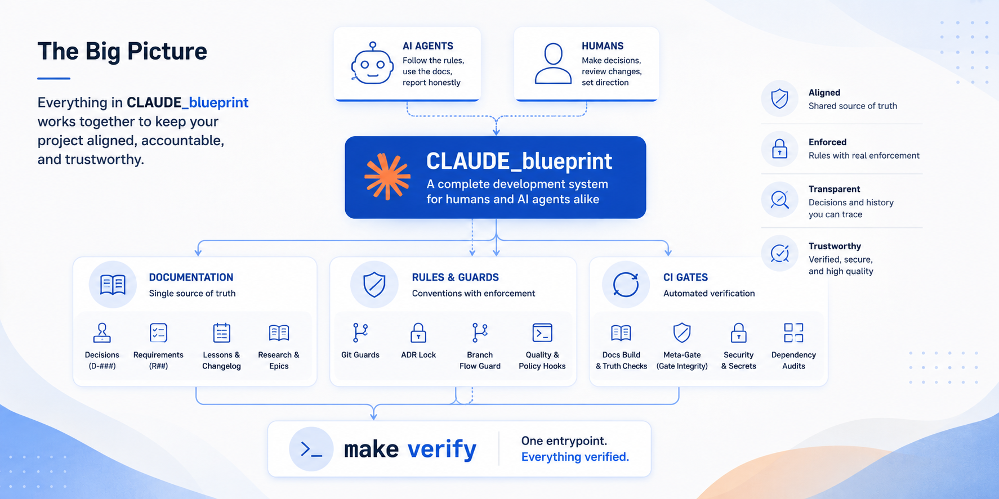
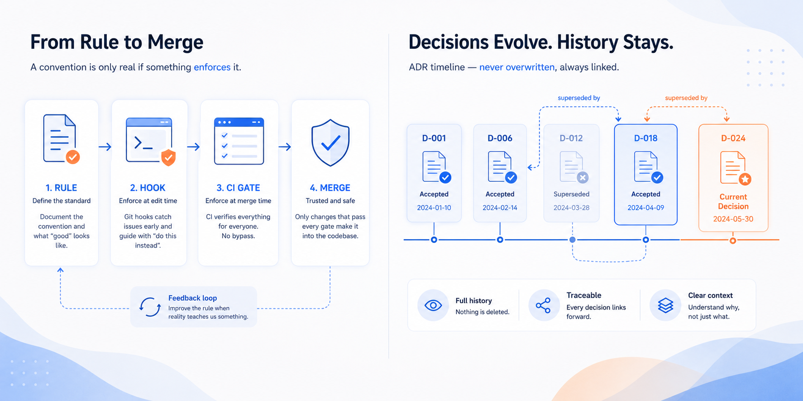
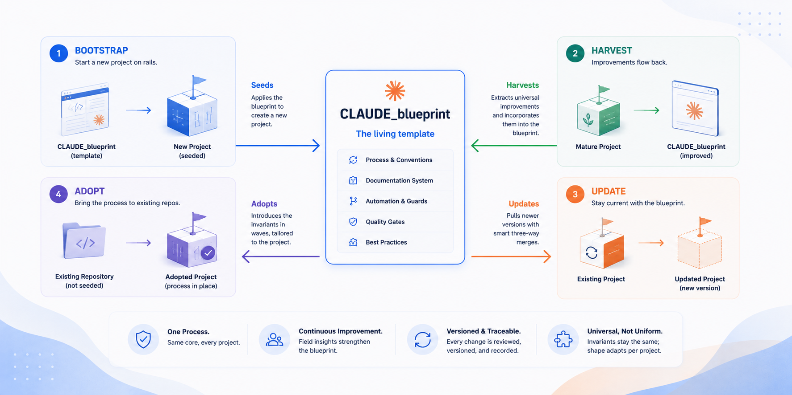

<!-- BLUEPRINT: this README describes the blueprint itself. At bootstrap,
replace this ENTIRE file with the seeded project's README (name, one-liner,
how to build the docs, pointer to the docs site, "Initialized from Project
Blueprint vN" footer) — see BOOTSTRAP.md → "Rewrite README.md". This marker
deliberately blocks scripts/check_bootstrap_complete.sh until that happens:
a seeded repo must never ship the blueprint's story as its own. -->

# Project Claude Blueprint

A template repository that seeds new projects with a complete, **enforced**
development process — canonical documentation, addressable decisions,
honest-reporting rules for AI agents, and CI gates that keep all of it true
— so every project starts on rails, for humans and AI agents alike.

> [!NOTE]
> **Agent-agnostic by design, Claude Code-tuned in practice.** The process and
> its enforcement are tool-neutral — the CI gates in `.github/workflows/` bind
> any agent or human, and `make verify` runs anywhere. The *agent-facing*
> ergonomics, though, are built for Claude Code: `CLAUDE.md` plus the `.claude/`
> hooks, commands, and skills. Other agents (e.g. Codex) get the same contract
> through a thin `AGENTS.md` that points back to `CLAUDE.md`.

> [!TIP]
> **Contents:**
> [Why it exists](#-why-it-exists) ·
> [What a seeded project gets](#-what-a-seeded-project-gets) ·
> [Philosophy](#-philosophy-invariants-in-the-core-shape-in-the-modules) ·
> [Working skeleton](#-the-repo-is-its-own-working-skeleton) ·
> [Instantiating](#-instantiating-a-new-project) ·
> [Layout](#-layout)

## 🧭 Why it exists

Long-running projects — especially AI-assisted ones — decay in predictable
ways: conventions live only as prose and drift; decisions get re-litigated
because nobody recorded them; findings rot in closed threads; agent working
notes pollute curated docs; verification claims go optimistic; and the gap
between "what the rules say" and "what the repo enforces" widens silently.

The blueprint packages the countermeasures as a working skeleton. Its core
principle is recorded as a founding decision (D-004): **a rule that names
no enforcer is just a wish** — every convention here either points at the
hook, CI gate, or test that catches violations, or is explicitly labelled
advisory with a reason.

## 📦 What a seeded project gets

**📚 A documentation system that is the single source of truth.**
MkDocs Material site with a strict build as a merge gate; stable typed IDs
(`D-###` decisions, `R##` requirements, `Q##` open questions, `P#`
principles) that are never renumbered; an ADR registry where decisions are
superseded, never rewritten; record lenses with one home per record type —
changelog (diary), lessons (the distilled "never again" list), epic pages
(curated stories), agent-research reports (rated maps); and reusable
templates under `docs/.templates/`.

**🛡️ Enforcement in layers** — prose points at hooks, hooks nudge or deny at
edit time with "do this instead" messages, CI binds every client:

- a git guard against push-to-main, force-pushes, self-merges,
  un-LFS'd binaries, and zombie pushes to a branch whose PR is already
  merged or closed (`.claude/hooks/guard-git.sh`);
- an edit lock on ✅ Decided decision records, with an expiring
  `/unlock-adr` token and a CI-checked commit trailer
  (`.claude/hooks/guard-adr.sh`, `.github/workflows/adr-gates.yml`);
- a server-side branch-flow guard — only the integration branch may
  promote into `main`, and a promotion must carry its release caboose:
  version bumped by exactly one operator-approved semver step + a
  release-log entry (`.github/workflows/branch-flow-guard.yml`; seam:
  `.claude/release.txt`);
- an issue-link guard — a PR whose body, title, or commits would
  keyword-close (`Closes`/`Fixes`/`Resolves`) an epic that still has open
  sub-issues, or any issue whose deliverable boxes are still unchecked,
  fails; only the epic's closeout PR may close it, and closing with open
  deliverables takes a declared trailer
  (`.github/workflows/issue-link-guard.yml`,
  `scripts/issue_link_decision.sh`);
- secret scanning and dependency audits on every PR **plus** a weekly
  sweep, with a value-scoped canary-convention allowlist designed not to
  silence real findings (`.github/workflows/security.yml`, `.gitleaks.toml`);
- a **meta-gate** that pins the gate wiring itself — a gate filtered away
  from the working branch or neutered by `continue-on-error` fails the
  build (`scripts/check_ci_gates.py`);
- a **docs truth-checker** — backtick-cited paths must exist, issues cited
  as open must actually be open, an in-progress epic page must cite an
  open epic issue (a wrongly-closed epic fails the next run), a sub-issue
  an epic page lists as built must be closed (an unclosed finished task
  fails it too), and cited
  CLI flags/env vars must exist in the code once the project has code;
  its dormant lane *owns its own activation* and demands configuration
  the moment code appears
  (`scripts/check_docs_truth.py`, seam: `.claude/docs-truth.txt`);
- exception lists are **ledgers** (D-004): a reason per entry, a size
  ceiling, stale entries fail loud, itemized matching only.

> [!IMPORTANT]
> Most of it converges on one entrypoint — **`make verify`** — which runs the
> locally-runnable layers and pins the wiring of the server-side gates
> (secret/dependency scanning, ADR-gate trailers, branch-flow) that only CI
> can execute.

**🤖 A behavioral contract for AI agents** (`CLAUDE.md` + on-demand skill
cards under `.claude/skills/`):

- hard rules and an autonomy contract — when to proceed, when to stop and
  ask, and the duty to review instructions critically rather than execute
  them blindly;
- *reproduce before you fix* — diagnose from the repo's current state, and
  halt when the reproduction contradicts the brief;
- *honest reporting* — unmeasured numbers stay "not measured"; every
  number names its source and sample size; capability claims carry exactly
  one maturity state;
- *adversarial verification* — load-bearing claims get a check that tries
  to **refute** them, in three grades scaled to risk, proposed with a cost
  so the owner can dial it up, down, or off;
- a sanctioned scratch space (`.claude/working/` → dated archive via
  `/handoff`) so agent notes never pollute curated docs;
- ritual slash commands (`.claude/commands/`) packaging the
  multi-step conventions, and a lessons ledger
  (`docs/records/lessons.md`) every future session inherits.

**🔧 GitHub wiring a template can't carry, scripted:** `scripts/github_setup.sh`
idempotently creates the integration branch, branch protection requiring the
template's diff-scoped gates by default (the dependency audit runs as a weekly
sweep, not a merge blocker, so a third-party disclosure can't freeze open PRs),
and the label taxonomy. Publishing the docs to GitHub Pages is opt-in
(`--deploy-docs`, default off): a private repo's Pages site can be publicly
reachable, so a seeded project doesn't publish until its owner asks.

## 🧱 Philosophy: invariants in the core, shape in the modules

The core encodes the process. Everything shape-dependent — Python package
skeleton, paired data repository, LFS asset patterns — is an optional
module under `modules/`, applied per project at bootstrap and deleted
afterwards. Process files are **literal** (byte-identical across projects,
which is what makes harvest diffs work); identity files are **generated**;
config files are **tokenized** (`blueprint/TOKENS.md`).

## 🧪 The repo is its own working skeleton

Core files live at their real destinations (`CLAUDE.md`, `docs/`,
`Makefile` at root), so the blueprint self-tests: `make verify` runs the
strict docs build, the CI meta-gate, and the docs truth-checker here,
exactly as it will in every seeded project. The guards guard this repo;
the ADR lock protects the blueprint's own decisions.

## 🚀 Instantiating a new project

1. **Create the repo from this template — pick one route:**
   - **A · GitHub UI** (recommended for most):
     
     — Full mechanics in GitHub's guide:
     [Creating a repository from a template](https://docs.github.com/en/repositories/creating-and-managing-repositories/creating-a-repository-from-a-template).
   - **B · `gh` CLI**: `gh repo create MyNewProject --private --template SharkyBamboozle/CLAUDE_blueprint --clone`.
2. Point a Claude session at the new repo: **"Run BOOTSTRAP.md."**
3. The session interviews you (name, one-liner, domain areas, binary-policy
   posture, which modules, whether to publish docs to Pages — default off),
   fills the placeholders, writes the judgment
   sections, passes the completion gate (`scripts/check_bootstrap_complete.sh`
   — no unfilled tokens, no unresolved judgment markers, including this
   README), deletes the blueprint machinery, commits *"Initialize from
   Project Blueprint vN"* to `main` (the one sanctioned direct push — repo
   birth), and runs `scripts/github_setup.sh`.

Improvements discovered in live projects flow back via `HARVEST.md`, run in
this repo — batched, judged, versioned and tagged (`blueprint/VERSION` +
changelog). The flow runs the other way too: seeded projects pull newer
blueprint versions with `UPDATE.md` (tier-aware three-way merges against
the tagged release they started from; decisions re-proposed, never
copied), and mature projects that were never seeded retrofit the process
in owner-approved waves with `ADOPT.md` (invariants, not shape).

## 🗺️ Layout

- `CLAUDE.md` — agent guidance: hard rules, autonomy contract, honest
  reporting, the map into `docs/`.
- `docs/` — the documentation skeleton: seeded registries (decisions,
  requirements, open questions, glossary), records (changelog, lessons,
  epics, agent-research), process pages (contributing hub + act pages,
  release checklist), and `docs/.templates/`.
- `.github/` — label taxonomy, issue forms, tri-state PR template, and
  the gate workflows (docs build + Pages, repo hygiene, ADR gates, branch
  flow, security).
- `.claude/` — harness policy: permissions, guard hooks with regression
  tests, session hooks, ritual commands, skill cards, the agent
  scratch space, and the single-source policy seams
  (`.claude/asset-dirs.txt`, `.claude/docs-truth.txt`).
- `scripts/` — repo tooling: GitHub setup, label sync, bootstrap gate, the
  CI meta-gate, the docs truth-checker, and the hook test suites.
- `modules/` — optional payloads applied at bootstrap; deleted afterwards.
- `blueprint/` — blueprint machinery (`VERSION`, `CHANGELOG.md`,
  `TOKENS.md`). Deleted at instantiation.
- `BOOTSTRAP.md` / `UPDATE.md` / `ADOPT.md` / `HARVEST.md` — the lifecycle
  rituals (🌱 birth · ⬆️ stay current · 🔁 retrofit · 🌾 feed back), each
  executed by an agent session invoked by filename; all deleted at
  instantiation. Kept at the top level deliberately — they are entry
  points, and the four verbs are the lifecycle at a glance (🧊 fold them
  into a directory when a fifth ritual appears).
- `CONTRIBUTING.md` — the front door for people improving the **template
  itself** (distinct from `docs/process/contributing.md`, the inherited
  process router). Not a lifecycle ritual — a human entry point GitHub
  surfaces on the public repo; like the rituals, deleted at instantiation so
  a seeded project never inherits it.
- `Makefile` — `make verify`, the single verification entrypoint.
